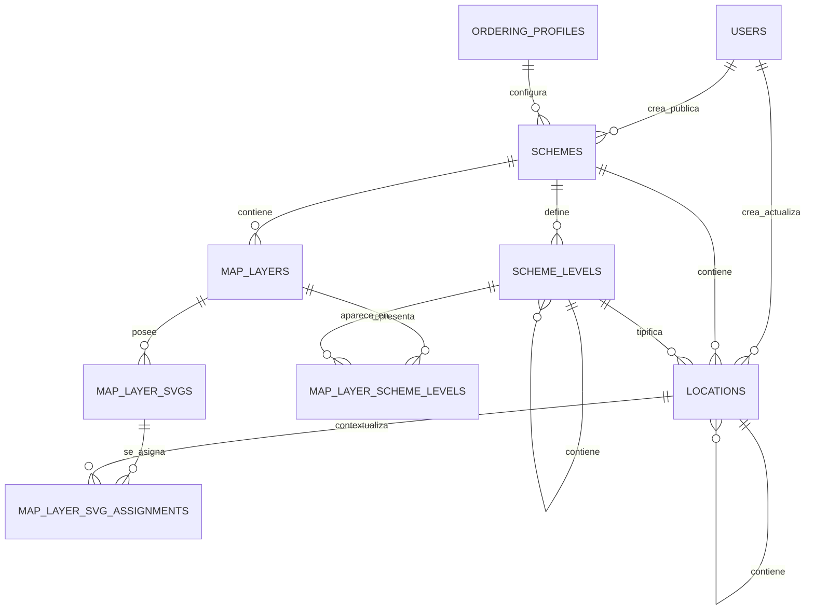

# Base de datos del localizador bibliográfico — V1

| Propiedad | Valor |
|---|---|
| Estado | Diseño V1 implementado por las migraciones iniciales; sin aplicación ni pruebas automatizadas en este repositorio |
| Versión del documento | 1.0 |
| Motor | PostgreSQL |
| Ámbito | Persistencia de perfiles, esquemas, ubicaciones, rangos y mapas SVG |
| Autoridad estructural | [`001_initial_schema.sql`](../../database/001_initial_schema.sql) |
| Autoridad de datos iniciales | [`002_seed_basic_ordering_profile.sql`](../../database/002_seed_basic_ordering_profile.sql) |
| Autoridad semántica | Este documento, dentro de las restricciones comprobables de la migración |
| Revisar cuando | Cambie una migración, una transición de `scheme_status`, una relación o una responsabilidad de la aplicación |

## 1. Propósito

La base de datos permite localizar libros dentro de una biblioteca mediante rangos de signaturas bibliográficas.

La V1 almacena y relaciona:

- esquemas jerárquicos de ubicaciones;
- ubicaciones físicas;
- rangos de signaturas en los puntos donde termina la precisión de búsqueda;
- claves comparables para resolver la ubicación de una signatura;
- mapas SVG superiores y vistas frontales reutilizables para representar el resultado.

La base de datos no interpreta por sí sola una signatura. El parsing, la normalización y la generación de la clave comparable corresponden a la aplicación y se rigen por documentos separados.

## 2. Documentos relacionados

| Documento | Responsabilidad |
|---|---|
| [`classification-ordering.md`](../classification-ordering.md) | Define qué orden bibliográfico es correcto. |
| [`normalization.md`](../normalization.md) | Define cómo interpretar y normalizar una signatura. |
| [`comparable_key.md`](../comparable_key.md) | Define cómo codificar el resultado como una clave binaria orden-preservante. |
| [`application-workflow-v1.md`](../workflows/application-workflow-v1.md) | Define el flujo canónico de configuración, mapas, publicación y búsqueda. |
| [Flujo de configuración](#8-flujo-de-configuración) | Resume el orden de escritura exigido por la base de datos. |
| [Flujo de búsqueda](#9-flujo-de-búsqueda) | Describe la localización por rango y la recuperación de mapas. |
| [`001_initial_schema.sql`](../../database/001_initial_schema.sql) | Implementa las tablas, relaciones, restricciones, índices y triggers de esta versión. |
| [`002_seed_basic_ordering_profile.sql`](../../database/002_seed_basic_ordering_profile.sql) | Inserta el perfil interno utilizado por los esquemas V1. |

Las decisiones todavía abiertas sobre guiones e indicador de edición DDC permanecen en la especificación de ordenamiento. Cuando esas decisiones modifiquen el resultado normalizado o la clave comparable, deberá crearse un nuevo `ordering_profile`.

## 3. Alcance de la V1

### 3.1 Incluido

- usuarios y datos básicos de auditoría;
- contratos versionados de ordenamiento;
- esquemas configurables de distribución;
- jerarquías de niveles y ubicaciones;
- terminales de búsqueda distintos por rama;
- un rango activo por ubicación terminal;
- claves comparables almacenadas como `BYTEA`;
- mapas exclusivamente SVG;
- mapas estáticos con códigos reales de ubicaciones;
- plantillas SVG reutilizables mediante slots;
- navegación o drilldown entre MapLayers;
- selección explícita de una plantilla para cada ubicación contextual.

### 3.2 No incluido

- mapas basados en PNG, JPEG u otras imágenes rasterizadas;
- geometrías dibujadas con rectángulos o polígonos;
- historial de rangos;
- múltiples rangos simultáneos por ubicación;
- versionado interno de archivos SVG;
- plantillas que representen varios niveles a la vez;
- persistencia individual de cada elemento encontrado dentro de un SVG;
- detección de solapamientos entre rangos;
- múltiples bibliotecas o tenants con un esquema activo independiente.

### 3.3 Supuestos técnicos

- Se recomienda PostgreSQL 14 o posterior.
- Las migraciones iniciales se ejecutan en orden sobre una base vacía.
- No requiere extensiones adicionales de PostgreSQL.
- Los nombres físicos se escriben en minúsculas y sin comillas para evitar sensibilidad accidental a mayúsculas.
- Las fechas utilizan `TIMESTAMPTZ`; la aplicación debe presentarlas en la zona horaria del usuario.
- Las claves comparables utilizan `BYTEA` y se comparan mediante el orden binario nativo de PostgreSQL.

## 4. Vista general del modelo



Relaciones principales:

```text
ordering_profiles
        ↓
     schemes
        ├── scheme_levels ── árbol de tipos de ubicación
        ├── locations ────── árbol de ubicaciones reales y rangos
        └── map_layers
              ├── niveles representados
              ├── SVG estáticos o plantillas
              └── asignaciones de plantillas a locations
```

## 5. Tipos enumerados

### 5.1 `scheme_status`

| Valor | Significado |
|---|---|
| `DRAFT` | El esquema se está diseñando. Sus niveles pueden modificarse. |
| `LEVELS_DEFINED` | Los niveles están definidos y sellados; la estructura de locations puede editarse. |
| `LOCATIONS_DEFINED` | Las locations están definidas y selladas; pueden configurarse mapas y comenzar el proceso de rangos. |
| `PARTIALLY_ASSIGNED` | La asignación de rangos comenzó, pero todavía no está completa. |
| `ASSIGNED` | Todas las ubicaciones terminales existentes poseen un rango completo. |

La aplicación debe recorrer estas etapas en orden. La base de datos vincula cada tipo de edición con su etapa y solo permite retroceder después de eliminar las dependencias creadas en etapas posteriores.

### 5.2 `map_layer_type`

| Valor | Significado |
|---|---|
| `TOP` | Vista superior. |
| `FRONT` | Vista frontal. |
| `OTHER` | Cualquier otra perspectiva definida por el nombre del MapLayer. |

### 5.3 `map_render_mode`

| Valor | Significado |
|---|---|
| `STATIC` | SVG concreto que contiene códigos reales de ubicaciones. |
| `TEMPLATE` | SVG genérico y reutilizable que contiene slots. |

`view_type` describe la perspectiva. `render_mode` describe cómo se vincula el archivo con las ubicaciones. Son dimensiones independientes.

## 6. Diccionario de datos

### 6.1 `users`

Almacena las cuentas que operan el sistema y sirven como referencias de auditoría.

| Campo | Tipo | Nulo | Uso |
|---|---|---:|---|
| `user_id` | `INTEGER IDENTITY` | No | Clave primaria. |
| `username` | `VARCHAR(60)` | No | Nombre de acceso, único sin distinguir mayúsculas. |
| `email` | `VARCHAR(255)` | No | Correo, único sin distinguir mayúsculas. |
| `password_hash` | `VARCHAR(255)` | No | Hash producido por el mecanismo de autenticación. Nunca contiene la contraseña original. |
| `full_name` | `VARCHAR(120)` | No | Nombre de presentación. |
| `enabled` | `BOOLEAN` | No | Permite deshabilitar la cuenta sin eliminarla. |
| `created_at` | `TIMESTAMPTZ` | No | Fecha de creación. |
| `last_login_at` | `TIMESTAMPTZ` | Sí | Último acceso exitoso. |
| `updated_at` | `TIMESTAMPTZ` | No | Se actualiza automáticamente. |

Los usuarios referenciados por datos de auditoría no pueden eliminarse. Deben deshabilitarse mediante `enabled = false`.

### 6.2 `ordering_profiles`

Representa el contrato completo utilizado para interpretar y comparar signaturas.

| Campo | Tipo | Nulo | Uso |
|---|---|---:|---|
| `ordering_profile_id` | `INTEGER IDENTITY` | No | Clave primaria. |
| `name` | `VARCHAR(80)` | No | Nombre único del perfil. |
| `description` | `TEXT` | Sí | Explicación funcional. |
| `ordering_spec_version` | `VARCHAR(20)` | No | Versión de las reglas bibliográficas. |
| `normalization_profile` | `VARCHAR(40)` | No | Perfil de parsing y normalización. |
| `comparable_key_version` | `SMALLINT` | No | Versión de la codificación binaria. Debe ser positiva. |
| `enabled` | `BOOLEAN` | No | Control de disponibilidad para nuevos esquemas. |
| `created_at` | `TIMESTAMPTZ` | No | Fecha de creación. |

La combinación de las tres versiones es única. Dos claves solo pueden compararse si fueron generadas con contratos compatibles.

Un perfil utilizado no debe editarse para cambiar su significado. Debe crearse otro registro con nuevas versiones y regenerar las claves del esquema que vaya a utilizarlo.

En la V1, `ordering_profiles` es configuración interna. El usuario no crea ni selecciona un perfil al crear un esquema. La migración `0.0.2` inserta este registro:

| Campo | Valor |
|---|---|
| `name` | `ddc-base-v1` |
| `description` | `Contrato interno V1 para signaturas basadas en DDC.` |
| `ordering_spec_version` | `1.0.0` |
| `normalization_profile` | `base-1` |
| `comparable_key_version` | `1` (`ck1`) |
| `enabled` | `true` |

La aplicación resuelve este perfil por su nombre estable, comprueba las versiones y asigna su `ordering_profile_id`. Su ausencia o deshabilitación es un error de configuración del sistema, no una decisión que deba trasladarse al usuario.

### 6.3 `schemes`

Representa una configuración completa de niveles, ubicaciones, rangos y mapas.

| Campo | Tipo | Nulo | Uso |
|---|---|---:|---|
| `scheme_id` | `INTEGER IDENTITY` | No | Clave primaria. |
| `name` | `VARCHAR(80)` | No | Nombre único del esquema. |
| `status` | `scheme_status` | No | Estado del ciclo de configuración. |
| `short_description` | `VARCHAR(255)` | Sí | Resumen para la interfaz. |
| `is_active` | `BOOLEAN` | No | Indica que el esquema atiende las búsquedas actuales. |
| `enabled` | `BOOLEAN` | No | Deshabilitación lógica. |
| `ordering_profile_id` | `INTEGER` | No | Contrato con el que se generaron sus claves. |
| `created_by` | `INTEGER` | Sí | Usuario creador. |
| `published_by` | `INTEGER` | Sí | Usuario que realizó la publicación. |
| `published_at` | `TIMESTAMPTZ` | Sí | Momento de publicación. |
| `created_at` | `TIMESTAMPTZ` | No | Fecha de creación. |
| `updated_at` | `TIMESTAMPTZ` | No | Se actualiza automáticamente. |

Restricciones:

- solamente puede existir un esquema activo en esta instalación;
- un esquema activo debe estar habilitado y en estado `ASSIGNED`;
- `published_by` y `published_at` aparecen juntos o permanecen ambos en `NULL`;
- el perfil de ordenamiento debe existir.

### 6.4 `scheme_levels`

Define la gramática del árbol, no las ubicaciones físicas individuales.

Ejemplo:

```text
Biblioteca
├── Sección
│   └── Mueble
│       └── Anaquel
└── Zona
    └── Estantería
```

| Campo | Tipo | Nulo | Uso |
|---|---|---:|---|
| `scheme_level_id` | `INTEGER IDENTITY` | No | Clave primaria. |
| `scheme_id` | `INTEGER` | No | Esquema al que pertenece. |
| `parent_level_id` | `INTEGER` | Sí | Nivel padre. `NULL` identifica la raíz. |
| `name` | `VARCHAR(60)` | No | Nombre del tipo de ubicación. |
| `sort_order` | `SMALLINT` | No | Orden entre niveles hermanos. |
| `is_search_terminal` | `BOOLEAN` | No | Indica dónde termina la precisión de búsqueda en esa rama. |
| `created_at` | `TIMESTAMPTZ` | No | Fecha de creación. |
| `updated_at` | `TIMESTAMPTZ` | No | Se actualiza automáticamente. |

`is_search_terminal` no significa hoja estructural. Un nivel terminal de búsqueda puede tener niveles hijos.

Ejemplo:

```text
Mueble        is_search_terminal = true
└── Anaquel   is_search_terminal = false
```

En ese caso, el sistema localiza el mueble completo. Si se necesita precisión por anaquel, se crea una nueva versión del esquema con:

```text
Mueble        is_search_terminal = false
└── Anaquel   is_search_terminal = true
```

Restricciones:

- un esquema tiene como máximo una raíz;
- un nivel no puede ser su propio padre;
- no se permiten ciclos;
- padre e hijo pertenecen al mismo esquema;
- nombre y `sort_order` no se repiten entre hermanos;
- los terminales forman una antichain: dos terminales no pueden aparecer en la misma ruta;
- al abandonar `DRAFT`, cada ruta raíz-hoja debe contener exactamente un terminal;
- los niveles solamente pueden modificarse mientras el esquema esté en `DRAFT`.

### 6.5 `locations`

Contiene las instancias físicas del árbol y los rangos utilizados por el buscador.

Ejemplo:

```text
Biblioteca principal
└── Mueble A
    ├── Anaquel A1
    ├── Anaquel A2
    └── Anaquel A3
```

| Campo | Tipo | Nulo | Uso |
|---|---|---:|---|
| `location_id` | `INTEGER IDENTITY` | No | Clave primaria. |
| `scheme_id` | `INTEGER` | No | Esquema al que pertenece. |
| `parent_location_id` | `INTEGER` | Sí | Ubicación padre. `NULL` identifica la raíz. |
| `scheme_level_id` | `INTEGER` | No | Nivel que tipifica la ubicación. |
| `name` | `VARCHAR(70)` | No | Nombre visible. |
| `code` | `VARCHAR(120)` | No | Código estable y único dentro del esquema; se utiliza en SVG estáticos. |
| `sort_order` | `SMALLINT` | No | Orden entre ubicaciones hermanas y orden de vinculación con slots. |
| `range_start_raw` | `VARCHAR(120)` | Sí | Signatura original del inicio. |
| `range_end_raw` | `VARCHAR(120)` | Sí | Signatura original del final. |
| `range_start_normalized` | `JSONB` | Sí | Representación normalizada del inicio. |
| `range_end_normalized` | `JSONB` | Sí | Representación normalizada del final. |
| `range_start_key` | `BYTEA` | Sí | Clave comparable del inicio. |
| `range_end_key` | `BYTEA` | Sí | Clave comparable del final. |
| `created_by` | `INTEGER` | Sí | Usuario creador. |
| `updated_by` | `INTEGER` | Sí | Último usuario modificador. |
| `created_at` | `TIMESTAMPTZ` | No | Fecha de creación. |
| `updated_at` | `TIMESTAMPTZ` | No | Se actualiza automáticamente. |

`scheme_id` se almacena directamente para:

- garantizar que el nivel y el padre pertenezcan al mismo esquema;
- hacer único `code` dentro del esquema;
- filtrar búsquedas sin reconstruir primero toda la jerarquía;
- indexar rangos y recorridos de navegación.

La aplicación genera `code` uniendo con guiones `scheme_id` y los `sort_order` de la ruta completa. Para el esquema `27`, una ruta con órdenes `1, 1, 1, 4, 5` produce `27-1-1-1-4-5`. Cada segmento usa representación decimal sin ceros iniciales. La base de datos exige unicidad, pero no genera el valor. El contrato completo está en [`application-workflow-v1.md`](../workflows/application-workflow-v1.md#52-nombres-y-códigos).

Reglas de jerarquía:

- la estructura solo puede crearse o modificarse cuando el esquema está en `LEVELS_DEFINED`;
- existe como máximo una raíz por esquema;
- una ubicación no puede ser su propio padre;
- no se permiten ciclos;
- la ubicación padre pertenece al mismo esquema;
- el nivel del hijo debe ser hijo directo del nivel de la ubicación padre;
- al pasar a `LOCATIONS_DEFINED`, cada ubicación debe materializar todos los niveles hijos definidos para su nivel;
- `sort_order` no se repite entre ubicaciones hermanas;
- `code` es único dentro del esquema.

Reglas del rango:

- solo puede persistirse en `PARTIALLY_ASSIGNED` o `ASSIGNED`;
- los seis campos del rango están todos presentes o todos ausentes;
- las representaciones normalizadas deben ser objetos JSON;
- `range_start_key <= range_end_key`;
- solamente una ubicación cuyo nivel sea `is_search_terminal = true` puede contener un rango;
- al pasar a `ASSIGNED`, todas las ubicaciones terminales existentes deben tener rango.

Una ubicación terminal puede conservar hijos estructurales. Esos hijos no almacenan rangos mientras su nivel no sea terminal de búsqueda. Los ancestros tampoco almacenan copias de los rangos: su cobertura se deriva según [`application-workflow-v1.md`](../workflows/application-workflow-v1.md#71-rangos-directos-y-cobertura-derivada).

### 6.6 `map_layers`

Define una vista lógica dentro de un esquema.

| Campo | Tipo | Nulo | Uso |
|---|---|---:|---|
| `map_layer_id` | `INTEGER IDENTITY` | No | Clave primaria. |
| `scheme_id` | `INTEGER` | No | Esquema al que pertenece. |
| `name` | `VARCHAR(120)` | No | Nombre único dentro del esquema. |
| `view_type` | `map_layer_type` | No | Perspectiva: `TOP`, `FRONT` u `OTHER`. |
| `render_mode` | `map_render_mode` | No | Mecanismo: `STATIC` o `TEMPLATE`. |
| `enabled` | `BOOLEAN` | No | Habilitación lógica. |
| `created_at` | `TIMESTAMPTZ` | No | Fecha de creación. |
| `updated_at` | `TIMESTAMPTZ` | No | Se actualiza automáticamente. |

Ejemplos:

| Nombre | `view_type` | `render_mode` |
|---|---|---|
| Vista superior general | `TOP` | `STATIC` |
| Vista frontal de muebles | `FRONT` | `TEMPLATE` |

La configuración de MapLayers solo puede crearse o modificarse cuando el esquema está en `LOCATIONS_DEFINED`, `PARTIALLY_ASSIGNED` o `ASSIGNED`.

### 6.7 `map_layer_scheme_levels`

Relaciona un MapLayer con los niveles cuyas ubicaciones aparecen en él.

| Campo | Tipo | Nulo | Uso |
|---|---|---:|---|
| `map_layer_id` | `INTEGER` | No | MapLayer de origen. |
| `scheme_level_id` | `INTEGER` | No | Nivel representado. |
| `drilldown_map_layer_id` | `INTEGER` | Sí | MapLayer que debe abrirse al seleccionar una ubicación de ese nivel. |

La clave primaria es `(map_layer_id, scheme_level_id)`.

Ejemplo:

```text
Vista superior + nivel Mueble
    └── drilldown: Vista frontal de muebles
```

Un MapLayer `STATIC` puede representar varios niveles. En esta V1, un MapLayer `TEMPLATE` puede representar solamente uno.

El MapLayer de origen, el nivel representado y el destino del drilldown deben pertenecer al mismo esquema. El origen no puede apuntarse a sí mismo.

### 6.8 `map_layer_svgs`

Registra los archivos SVG pertenecientes a cada MapLayer.

| Campo | Tipo | Nulo | Uso |
|---|---|---:|---|
| `map_layer_svg_id` | `INTEGER IDENTITY` | No | Clave primaria. |
| `map_layer_id` | `INTEGER` | No | MapLayer propietario. |
| `name` | `VARCHAR(120)` | No | Nombre visible del archivo o variante. |
| `variant_code` | `VARCHAR(60)` | Sí | Código funcional de la plantilla. Es obligatorio en modo `TEMPLATE`. |
| `asset_url` | `TEXT` | No | Dirección estable del archivo SVG. |
| `slot_count` | `SMALLINT` | Sí | Cantidad de slots de la plantilla. Es obligatorio y positivo en modo `TEMPLATE`. |
| `enabled` | `BOOLEAN` | No | Habilitación lógica. |
| `created_at` | `TIMESTAMPTZ` | No | Fecha de creación. |
| `updated_at` | `TIMESTAMPTZ` | No | Se actualiza automáticamente. |

Reglas por modo:

| Regla | `STATIC` | `TEMPLATE` |
|---|---:|---:|
| Usa códigos reales de `locations` | Sí | No |
| Usa slots genéricos | No | Sí |
| `slot_count` | Debe ser `NULL` | Obligatorio y positivo |
| `variant_code` | Opcional | Obligatorio |
| SVG habilitados por MapLayer | Máximo uno | Varios |

Ejemplos de variantes:

```text
STRAIGHT-4: 4 slots
STRAIGHT-5: 5 slots
CORNER-4: 4 slots
```

Dos variantes del mismo MapLayer no pueden usar el mismo `variant_code`.

### 6.9 `map_layer_svg_assignments`

Asigna una plantilla SVG reutilizable a una ubicación contextual concreta.

| Campo | Tipo | Nulo | Uso |
|---|---|---:|---|
| `map_layer_id` | `INTEGER` | No | MapLayer de plantilla. |
| `map_layer_svg_id` | `INTEGER` | No | Variante SVG seleccionada. |
| `context_location_id` | `INTEGER` | No | Ubicación cuyo interior será representado. |
| `created_at` | `TIMESTAMPTZ` | No | Fecha de asignación. |

La clave primaria es `(map_layer_id, context_location_id)`. Una ubicación puede tener una asignación en cada MapLayer, pero no dos variantes simultáneas dentro del mismo MapLayer.

Ejemplo:

```text
Mueble A: STRAIGHT-4
Mueble B: STRAIGHT-4
Mueble C: STRAIGHT-5
Mueble D: CORNER-4
```

Una asignación es válida cuando:

- el MapLayer está en modo `TEMPLATE`;
- representa exactamente un nivel;
- la ubicación contextual pertenece al nivel padre del nivel representado;
- ubicación, nivel y MapLayer pertenecen al mismo esquema;
- el SVG está habilitado y pertenece al MapLayer;
- `slot_count` coincide con la cantidad de hijos representables de la ubicación contextual.

Una plantilla asignada no puede cambiar de MapLayer, cantidad de slots ni deshabilitarse sin eliminar antes sus asignaciones.

## 7. Cardinalidades y comportamiento al eliminar

| Origen | Dependiente | Cardinalidad | Eliminación |
|---|---|---|---|
| `ordering_profiles` | `schemes` | 1:N | Un perfil utilizado no puede eliminarse. |
| `schemes` | `scheme_levels` | 1:N | El esquema no puede eliminarse mientras tenga niveles. |
| `scheme_levels` | `scheme_levels` | 1:N autorreferenciada | Un padre no puede eliminarse mientras tenga hijos. |
| `schemes` | `locations` | 1:N | El esquema no puede eliminarse mientras tenga ubicaciones. |
| `scheme_levels` | `locations` | 1:N | Un nivel utilizado no puede eliminarse. |
| `locations` | `locations` | 1:N autorreferenciada | Un padre no puede eliminarse mientras tenga hijos. |
| `schemes` | `map_layers` | 1:N | Un esquema con MapLayers no puede eliminarse. |
| `map_layers` | `map_layer_scheme_levels` | 1:N | Al eliminar el MapLayer se eliminan sus asociaciones de nivel. |
| `map_layers` | `map_layer_svgs` | 1:N | Al eliminar el MapLayer se eliminan sus SVG. |
| `map_layer_svgs` | `assignments` | 1:N | Al eliminar el SVG se eliminan sus asignaciones. |
| `locations` | `assignments` | 1:N | Al eliminar la ubicación se eliminan sus asignaciones. |
| `map_layer` de origen | `map_layer` de drilldown | N:1 | Si se elimina el destino, el drilldown queda en `NULL`. |

Los usuarios, esquemas y perfiles tienen mecanismos de deshabilitación lógica. La operación normal es establecer `enabled = false`, no eliminar registros utilizados.

## 8. Flujo de configuración

Esta sección resume el orden de escritura que exige el esquema.

### 8.1 Preparar el contrato de ordenamiento

1. Aplicar la migración `0.0.2` para insertar `ddc-base-v1`.
2. Resolver internamente ese registro y comprobar que está habilitado.
3. Crear el esquema apuntando a su `ordering_profile_id`, sin solicitar una selección al usuario.

### 8.2 Definir la gramática

1. Mantener el esquema en `DRAFT`.
2. Crear el nivel raíz.
3. Crear sus ramas y ordenar los niveles hermanos.
4. Marcar el terminal de búsqueda correspondiente en cada rama.
5. Cambiar el esquema a `LEVELS_DEFINED`.

La transición falla si una rama no posee exactamente un terminal de búsqueda.

### 8.3 Crear ubicaciones y rangos

1. Crear la ubicación raíz.
2. Crear sus descendientes respetando la relación entre niveles.
3. Asignar códigos estables y `sort_order`.
4. Validar la estructura de ubicaciones.
5. Cambiar el esquema a `LOCATIONS_DEFINED` para sellarla.
6. Cambiar a `PARTIALLY_ASSIGNED` al iniciar el primer rango.
7. Registrar rangos únicamente en ubicaciones terminales.
8. Cambiar a `ASSIGNED` cuando todos los terminales tengan rango.
9. Activar el esquema con `is_active = true`.

La migración de estructura protege las transiciones y precondiciones estructurales.

### 8.4 Configurar mapas

1. Crear al menos un MapLayer superior `TOP/STATIC`.
2. Asociarlo con los niveles que contiene el SVG.
3. Cargar su único SVG habilitado con códigos reales.
4. Comprobar antes de publicar que todo terminal con rango tenga un ancestro representado en una capa superior habilitada.
5. Opcionalmente, crear el MapLayer frontal `FRONT/TEMPLATE`.
6. Asociarlo con el nivel representado, por ejemplo `Anaquel`.
7. Crear las variantes SVG con slots.
8. Enlazar el nivel `Mueble` de la vista superior con la vista frontal mediante `drilldown_map_layer_id`.
9. Asignar una variante frontal a cada mueble que tendrá vista de detalle.

La V1 limita el drilldown a `TOP` con destino `FRONT`. Si no existe una vista frontal, el resultado utiliza solamente la capa superior.

## 9. Flujo de búsqueda

La búsqueda pública exige un esquema activo. Si no existe, la aplicación no ejecuta la consulta y muestra un error comprensible. La revisión interna puede recibir un `scheme_id` específico aunque ese esquema no esté activo.

Las consultas siguientes muestran el acceso a los datos durante una búsqueda.

```text
Signatura solicitada
        ↓
Perfil del esquema activo
        ↓
Parsing y normalización
        ↓
Generación de comparable_key
        ↓
Búsqueda de rangos contenedores
        ↓
Locations terminales
        ↓
Ancestros + MapLayers + plantillas disponibles
        ↓
Resultados visuales
```

### 9.1 Encontrar el rango

```sql
SELECT
  l.location_id,
  l.code,
  l.name,
  l.range_start_raw,
  l.range_end_raw
FROM locations AS l
WHERE l.scheme_id = :scheme_id
  AND l.range_start_key IS NOT NULL
  AND l.range_start_key <= :search_key
  AND l.range_end_key >= :search_key
ORDER BY l.sort_order, l.location_id;
```

El índice `locations_range_lookup_idx` soporta este patrón. Los rangos pueden solaparse y la aplicación conserva todas las filas coincidentes. Resalta todos sus componentes superiores y muestra una vista frontal por cada ubicación contextual distinta cuando esas vistas existen.

### 9.2 Obtener los ancestros

```sql
WITH RECURSIVE location_path AS (
  SELECT
    location_id,
    parent_location_id,
    scheme_level_id,
    code,
    name,
    0 AS depth
  FROM locations
  WHERE location_id = :location_id

  UNION ALL

  SELECT
    parent.location_id,
    parent.parent_location_id,
    parent.scheme_level_id,
    parent.code,
    parent.name,
    child.depth + 1
  FROM locations AS parent
  JOIN location_path AS child
    ON parent.location_id = child.parent_location_id
)
SELECT *
FROM location_path
ORDER BY depth DESC;
```

### 9.3 Abrir una vista frontal

```sql
SELECT
  ml.name AS map_layer_name,
  svg.name AS svg_name,
  svg.asset_url,
  svg.slot_count
FROM map_layer_svg_assignments AS assignment
JOIN map_layers AS ml
  ON ml.map_layer_id = assignment.map_layer_id
JOIN map_layer_svgs AS svg
  ON svg.map_layer_id = assignment.map_layer_id
 AND svg.map_layer_svg_id = assignment.map_layer_svg_id
WHERE assignment.context_location_id = :furniture_location_id
  AND ml.enabled
  AND svg.enabled;
```

Los hijos de la ubicación contextual se ordenan por `sort_order` y se vinculan con `slot-1`, `slot-2`, etc.

## 10. Convención para SVG

### 10.1 SVG estático

Un SVG estático utiliza códigos reales:

```xml
<g data-location-code="27-1-1-1-4">...</g>
<g data-location-code="27-1-1-2-4">...</g>
```

El sistema debe validar al cargarlo que cada código:

- exista en `locations`;
- pertenezca al esquema del MapLayer;
- pertenezca a uno de los niveles representados;
- no esté repetido en el archivo.

### 10.2 Plantilla SVG

Una plantilla utiliza identificadores genéricos:

```xml
<g data-slot="1">...</g>
<g data-slot="2">...</g>
<g data-slot="3">...</g>
<g data-slot="4">...</g>
```

Para un mueble concreto, la aplicación vincula los hijos ordenados:

```text
slot-1: primer hijo por `sort_order`
slot-2: segundo hijo por `sort_order`
slot-3: tercer hijo por `sort_order`
slot-4: cuarto hijo por `sort_order`
```

La base de datos comprueba la cantidad, pero la aplicación debe validar que el archivo tenga exactamente los slots declarados y que no estén duplicados.

## 11. Exportación para diseño en Figma

### 11.1 Mapa estático

La exportación incluye códigos reales:

```csv
location_code,name,level_name,sort_order
27-1-1-1-4,Mueble 4,Mueble,4
27-1-1-2-4,Mueble 4,Mueble,4
```

### 11.2 Plantilla

La exportación describe slots genéricos:

```csv
slot_key,position
slot-1,1
slot-2,2
slot-3,3
slot-4,4
```

Las plantillas se diseñan una vez y se reutilizan mediante `map_layer_svg_assignments`.

## 12. Índices principales

| Índice lógico | Objetivo |
|---|---|
| Usuario y correo en minúsculas | Evitar duplicados que solo difieran en mayúsculas. |
| Un esquema activo | Garantizar un único esquema operativo. |
| Raíz de niveles y ubicaciones | Evitar más de una raíz por esquema. |
| Padre + orden | Recuperar cada árbol por padre y `sort_order`. |
| Esquema + código | Resolver elementos de SVG estáticos. |
| Esquema + claves de rango | Ejecutar la búsqueda bibliográfica principal. |
| MapLayer + `slot_count` | Proponer plantillas compatibles. |
| Ubicación contextual | Resolver la plantilla asignada a una ubicación. |

Las PK y restricciones `UNIQUE` también crean índices propios en PostgreSQL.

## 13. Responsabilidades de la aplicación

La base de datos protege la integridad estructural, pero la aplicación debe:

- autenticar usuarios registrados y aplicarles el mismo permiso administrativo;
- normalizar `username` y `email` antes de guardar;
- interpretar signaturas según `normalization_profile`;
- generar claves según `comparable_key_version`;
- impedir la comparación de claves de perfiles incompatibles;
- generar los JSON normalizados con el formato documentado;
- sanitizar SVG según el flujo de aplicación y persistir solamente el resultado seguro;
- validar `data-location-code` y `data-slot` dentro de los archivos;
- almacenar el archivo y proporcionar un `asset_url` estable;
- generar los CSV para Figma;
- sugerir variantes por `slot_count` y solicitar una elección cuando existan varias;
- controlar las transiciones de estado permitidas por la interfaz;
- exigir confirmación antes de las transiciones a `LEVELS_DEFINED` y `LOCATIONS_DEFINED`;
- conservar todos los resultados provocados por rangos solapados y agrupar sus vistas frontales por ubicación contextual;
- bloquear la publicación cuando falte cobertura en una capa superior habilitada;
- permitir resultados solo textuales únicamente en la revisión interna.

## 14. Operaciones y migraciones

### 14.1 Aplicación inicial

Las migraciones se ejecutan una sola vez y en este orden sobre una base vacía:

```text
001_initial_schema.sql
002_seed_basic_ordering_profile.sql
```

Cada archivo está envuelto en su propia transacción. Si falla `001`, no existe estructura donde aplicar `002`. Si falla `002`, la estructura permanece creada, pero la instalación no está lista para crear esquemas V1.

### 14.2 Convenciones para migraciones posteriores

- No editar una migración que ya haya sido aplicada en un entorno compartido.
- Crear archivos consecutivos: `002_...sql`, `003_...sql`, etc.
- No modificar el significado de un `ordering_profile` utilizado.
- Cuando cambie la codificación comparable, crear una nueva versión y regenerar las claves afectadas.
- Los cambios de granularidad terminal deben producir una nueva versión funcional del esquema o requerir volverlo explícitamente a `DRAFT`.
- Realizar primero cambios de estructura y después cambios de estado.

## 15. Limitaciones y evolución prevista

Posibles extensiones posteriores a la V1:

1. historial de rangos y auditoría de levantamientos;
2. herramientas administrativas para inspeccionar rangos solapados permitidos;
3. múltiples sedes con un esquema activo por sede;
4. versionado de SVG y almacenamiento de hash de contenido;
5. validación persistente de los elementos encontrados al importar un SVG;
6. imágenes rasterizadas con rectángulos o polígonos;
7. plantillas con varios niveles o grupos de slots tipificados;
8. reglas de transición de estado más estrictas;
9. pruebas automatizadas de integridad y rendimiento con datos reales.

## 16. Criterios de conformidad de la V1

Una instalación cumple esta especificación cuando:

- ambas migraciones iniciales se aplican completamente sobre PostgreSQL;
- existe un perfil habilitado `ddc-base-v1` con las versiones `1.0.0`, `base-1` y `ck1`;
- la creación de esquemas asigna ese perfil sin solicitarlo al usuario;
- cada esquema no borrador tiene exactamente un terminal por rama;
- las ubicaciones respetan la gramática de niveles;
- todos los rangos utilizan claves del perfil asociado al esquema;
- un esquema activo está en `ASSIGNED` y todos sus terminales tienen rango;
- todo esquema publicado tiene al menos una capa superior habilitada que cubre sus terminales con rango;
- los SVG estáticos utilizan códigos existentes;
- las plantillas utilizan slots consecutivos compatibles con `slot_count`;
- cada asignación frontal enlaza una ubicación contextual con una variante del mismo esquema;
- la búsqueda conserva todos los rangos coincidentes y representa todos sus componentes superiores;
- el drilldown, cuando existe, conecta una capa `TOP` con una capa `FRONT` del mismo esquema.
