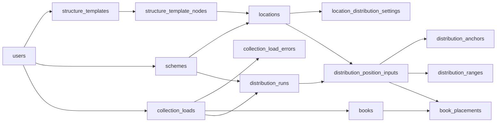

# Modelo de base de datos

## 1. Propósito

Este modelo soporta el localizador de libros de la Biblioteca José Figueres
Ferrer. Separa cuatro responsabilidades:

1. importar y normalizar la colección;
2. modelar la estructura física de la biblioteca;
3. calcular y versionar distribuciones;
4. publicar una ubicación aproximada para cada libro.

La estructura física y la distribución se versionan por separado. Un cambio en
la biblioteca no altera una distribución publicada: se crea un nuevo `scheme`
o una nueva `distribution_run`, según corresponda.

## 2. Mapa conceptual



## 3. Convenciones

### Identificadores

Cada tabla usa una clave primaria numérica. Los identificadores no contienen
información de negocio y no deben mostrarse como nombres al público.

### Fechas

Las fechas usan `TIMESTAMPTZ` para conservar el instante real del evento. Los
campos `created_at` y `updated_at` permiten auditoría básica y sincronización.
El modelo asigna automáticamente `created_at`, pero no contiene un trigger
general para `updated_at`; la aplicación debe actualizarlo cuando modifica una
fila.

### Usuarios opcionales

Los campos como `created_by`, `updated_by` y `reviewed_by` aceptan `NULL`.
Cuando se elimina una cuenta, el registro de negocio se conserva y solamente se
elimina la referencia al usuario.

### Borrado

- Los datos internos de una entidad se eliminan con ella cuando no tienen
  significado independiente, por ejemplo los libros de una carga.
- Los datos históricos se restringen cuando eliminarlos rompería la
  trazabilidad, por ejemplo una carga utilizada por una corrida.
- El borrado de una plantilla o un `scheme` debe ser una operación
  administrativa excepcional. Para el uso normal existen `enabled` y estados
  de archivo.

### Códigos comparables

Los campos terminados en `_key` contienen la representación normalizada y
ordenable de un código de clasificación. Usan colación `C` para que el orden no
dependa de la configuración regional de PostgreSQL.

Los campos terminados en `_code` conservan una representación legible para el
personal y la interfaz.

## 4. Tipos enumerados

### `scheme_status`

| Valor | Uso |
|---|---|
| `DRAFT` | La estructura todavía se está modelando. |
| `DEFINED` | La estructura pasó las validaciones y puede distribuirse. |
| `DISTRIBUTED` | El `scheme` tiene una distribución terminada y puede publicarse. |

### `structure_template_status`

| Valor | Uso |
|---|---|
| `DRAFT` | La plantilla y sus nodos pueden modificarse. |
| `ACTIVE` | La plantilla está validada y puede instanciarse. |
| `ARCHIVED` | No admite nuevas instancias, pero conserva las existentes. |

Una plantilla `ACTIVE` no puede regresar a `DRAFT`. Esto evita cambiar la forma
que ya utilizan estructuras concretas.

### `process_status`

| Valor | Uso |
|---|---|
| `PENDING` | El proceso fue creado y todavía no terminó. |
| `DONE` | El proceso terminó correctamente. |
| `ERROR` | El proceso no pudo completarse. |

Se comparte entre importaciones y corridas porque ambas son operaciones
asíncronas con el mismo ciclo básico.

### `location_role`

| Valor | Uso |
|---|---|
| `CONTAINER` | Agrupa otras ubicaciones y construye la jerarquía. |
| `POSITION` | Es una ubicación hoja que puede recibir parte de la colección. |

Los nombres físicos, como sección, estantería, cara o anaquel, los define la
plantilla. Los roles son fijos porque el algoritmo solamente necesita saber si
un nodo agrupa o recibe libros.

### `range_source`

| Valor | Uso |
|---|---|
| `AUTO` | Resultado calculado sin una frontera manual determinante. |
| `ANCHORED` | Resultado condicionado por un límite conocido. |
| `MANUAL` | Resultado establecido directamente por el personal. |

Este origen se guarda tanto en rangos como en asignaciones para distinguir
decisiones del algoritmo de intervenciones humanas.

### `distribution_strategy`

| Valor | Uso |
|---|---|
| `CAPACITY` | Reparto según capacidad aproximada en libros. |
| `WEIGHTED` | Reparto proporcional según pesos o medidas compatibles. |
| `ANCHORED` | Los límites conocidos son el criterio principal. |
| `HYBRID` | Combina límites conocidos con capacidades o pesos. |
| `MANUAL` | El personal establece la distribución. |

La estrategia predeterminada es `HYBRID`, porque permite partir de una
estimación algorítmica y mejorarla con conocimiento físico.

El tipo solo almacena la elección. El servicio aplica este contrato:

| Estrategia | Entrada obligatoria | Entrada no admitida |
|---|---|---|
| `CAPACITY` | Capacidades `BOOKS` | Anchors |
| `WEIGHTED` | `WEIGHT` o `CENTIMETERS` compatibles | Anchors |
| `ANCHORED` | Anchor para cada posición posterior a la primera | Anchors parciales |
| `HYBRID` | Capacidades o pesos compatibles | Rangos manuales |
| `MANUAL` | Cobertura completa de rangos | Anchors |

`ANCHORED` usa fronteras suficientes para determinar la distribución.
`HYBRID` se usa cuando solo se conocen algunas. Una entrada incompatible debe
rechazarse; no se ignora silenciosamente.

### `capacity_unit`

| Valor | Uso |
|---|---|
| `BOOKS` | Cantidad aproximada de registros que recibe una posición. |
| `CENTIMETERS` | Longitud útil; funciona proporcionalmente si no se conoce el grosor de cada libro. |
| `WEIGHT` | Peso relativo sin una unidad física. |

Una corrida debe utilizar unidades compatibles. No se puede comparar
directamente `BOOKS` con `CENTIMETERS`.

### `load_error_severity`

| Valor | Uso |
|---|---|
| `REVIEW` | La fila puede importarse, pero requiere revisión. |
| `REJECTED` | La fila no puede incorporarse como libro válido. |

### `user_role`

| Valor | Uso |
|---|---|
| `ADMIN` | Personal autorizado para administrar el sistema. |

La primera versión solo necesita un rol. Mantenerlo como tipo explícito permite
agregar permisos diferenciados sin cambiar la estructura de `users`.

## 5. Administración y modelado físico

### `users`

**Propósito:** almacenar las cuentas del panel administrativo.

La búsqueda pública no depende de esta tabla. Las cuentas se utilizan para
autenticar y atribuir cambios administrativos.

| Campo | Por qué existe |
|---|---|
| `user_id` | Identificador interno y clave primaria. |
| `username` | Nombre único utilizado para identificar la cuenta durante el inicio de sesión. |
| `email` | Dirección única para identificar y contactar a la persona administradora. |
| `password_hash` | Hash de la contraseña. Nunca se guarda la contraseña original. |
| `full_name` | Nombre legible para auditoría y presentación en el panel. Es opcional. |
| `role` | Define los permisos de la cuenta. En esta versión solo existe `ADMIN`. |
| `enabled` | Permite desactivar el acceso sin eliminar la cuenta ni perder su historial. |
| `last_login_at` | Registra el último acceso exitoso. No implementa reintentos ni bloqueos. |
| `created_at` | Fecha de creación de la cuenta. |
| `updated_at` | Fecha de la última modificación. |

Reglas principales:

- `username` y `email` son únicos.
- La eliminación de un usuario no elimina los objetos que creó.

### `schemes`

**Propósito:** representar una versión completa de la estructura física de la
biblioteca.

Un `scheme` contiene el árbol concreto de ubicaciones y su orden. Las plantillas
describen formas reutilizables; el `scheme` registra cuántas estructuras físicas
existen realmente.

| Campo | Por qué existe |
|---|---|
| `scheme_id` | Identificador interno del esquema. |
| `name` | Nombre único para distinguir versiones o propuestas. |
| `description` | Contexto opcional sobre el alcance o motivo del esquema. |
| `status` | Controla el avance `DRAFT -> DEFINED -> DISTRIBUTED`. |
| `is_active` | Indica cuál esquema consulta la búsqueda pública. |
| `enabled` | Retira un esquema del uso normal sin eliminar su historial. |
| `based_on_scheme_id` | Registra que el esquema se creó a partir de otro. Sirve para trazabilidad; la copia la realiza la aplicación. |
| `created_by` | Usuario que creó el esquema. |
| `created_at` | Fecha de creación. |
| `updated_at` | Fecha de la última modificación. |

Reglas principales:

- Solo puede existir un `scheme` activo.
- Un `scheme` activo debe estar en `DISTRIBUTED`.
- Para activarse debe tener una `distribution_run` publicada y terminada.
- Eliminar el esquema elimina sus ubicaciones y corridas porque ambas carecen de
  significado fuera de esa versión.

### `structure_templates`

**Propósito:** definir formas jerárquicas reutilizables.

Una plantilla puede representar, por ejemplo:

```text
Sección (CONTAINER)
└── Estantería (CONTAINER)
    └── Anaquel (POSITION)
```

La plantilla define la forma, no la cantidad. Dos estructuras pueden usar la
misma plantilla y tener números distintos de estanterías o anaqueles.

| Campo | Por qué existe |
|---|---|
| `structure_template_id` | Identificador interno de la plantilla. |
| `name` | Nombre único para seleccionarla y administrarla. |
| `description` | Explica para qué estructura física fue diseñada. |
| `status` | Controla si puede editarse, instanciarse o solo conservarse. |
| `enabled` | Permite ocultarla del uso normal sin romper instancias existentes. |
| `created_by` | Usuario que creó la plantilla. |
| `created_at` | Fecha de creación. |
| `updated_at` | Fecha de la última modificación. |

Reglas principales:

- Solo una plantilla `DRAFT` permite modificar sus nodos.
- Para pasar a `ACTIVE` necesita un nodo raíz y al menos una `POSITION`.
- Una plantilla `ARCHIVED` conserva sus instancias, pero no permite crear otras.

### `structure_template_nodes`

**Propósito:** almacenar los nodos que forman el árbol de una plantilla.

Cada fila define un tipo de nodo dentro de esa forma. No representa todavía un
mueble o anaquel real.

| Campo | Por qué existe |
|---|---|
| `structure_template_node_id` | Identificador del nodo de plantilla. |
| `structure_template_id` | Plantilla a la que pertenece. Impide mezclar nodos de formas diferentes. |
| `parent_template_node_id` | Nodo padre. `NULL` identifica la raíz de la plantilla. |
| `name` | Nombre funcional del nivel, por ejemplo `Sección`, `Cara` o `Anaquel`. |
| `role` | Indica si el nodo agrupa (`CONTAINER`) o recibe distribución (`POSITION`). |
| `sort_order` | Orden predeterminado entre nodos hermanos de la plantilla. |
| `visual_kind` | Categoría visual opcional para que la interfaz elija una representación apropiada. No determina la jerarquía. |
| `default_capacity_value` | Capacidad predeterminada para las ubicaciones que instancien este nodo `POSITION`. |
| `default_capacity_unit` | Explica si la capacidad está expresada en libros, centímetros o peso relativo. |
| `default_target_fill_ratio` | Porción predeterminada de la capacidad que se intenta ocupar. |
| `default_allow_overflow` | Política predeterminada para superar el objetivo de llenado. |
| `enabled` | Permite deshabilitar el nodo durante el diseño sin borrarlo inmediatamente. |
| `created_at` | Fecha de creación. |
| `updated_at` | Fecha de la última modificación. |

Reglas principales:

- Cada plantilla tiene como máximo una raíz.
- Un nodo no puede ser su propio padre.
- Una `POSITION` no puede tener hijos.
- Solo las `POSITION` admiten valores predeterminados de distribución.
- La capacidad y su unidad se definen juntas.
- `default_target_fill_ratio` debe ser mayor que `0` y menor o igual que `1`.
- Nombres y órdenes no se repiten entre nodos hermanos.
- Un nodo no puede moverse a otra plantilla.

### `locations`

**Propósito:** representar las ubicaciones físicas concretas de un `scheme`.

Una fila puede ser una sección, una estantería, una cara o un anaquel real. Su
rol se obtiene del nodo de plantilla que instancia.

| Campo | Por qué existe |
|---|---|
| `location_id` | Identificador de la ubicación concreta. |
| `scheme_id` | Esquema al que pertenece la ubicación. |
| `structure_template_id` | Plantilla utilizada por la instancia. También asegura que padres e hijos pertenezcan a la misma forma. |
| `structure_template_node_id` | Nodo de plantilla que determina el tipo y rol de la ubicación. |
| `parent_location_id` | Ubicación física padre. `NULL` identifica una raíz del esquema. |
| `name` | Etiqueta concreta, por ejemplo `Estantería 4` o `Anaquel B`. |
| `sort_order` | Orden entre ubicaciones hermanas. Permite recorrer físicamente la estructura. |
| `leaf_sequence` | Orden global derivado para las `POSITION`. Es la secuencia utilizada por la distribución. |
| `map_element_id` | Identificador del elemento correspondiente en el mapa esquemático. Vincula datos y representación visual sin guardar SVG en la base de datos. |
| `enabled` | Excluye temporalmente una ubicación del uso normal sin eliminarla. |
| `created_at` | Fecha de creación. |
| `updated_at` | Fecha de la última modificación. |

Reglas principales:

- Una ubicación solo puede crearse desde una plantilla `ACTIVE`.
- La raíz concreta debe instanciar la raíz de su plantilla.
- El padre concreto debe corresponder al padre definido en la plantilla.
- Una `POSITION` no tiene hijos.
- Solo una `POSITION` puede tener `leaf_sequence`.
- Nombres y órdenes son únicos entre ubicaciones hermanas.
- Los nombres y órdenes de raíces son únicos dentro del `scheme`.
- `map_element_id` y `leaf_sequence` son únicos dentro del `scheme`.
- Un padre y su hijo pertenecen al mismo `scheme` y a la misma instancia de
  plantilla.

`sort_order` y `leaf_sequence` no cumplen la misma función:

- `sort_order` ordena hermanos dentro del árbol;
- `leaf_sequence` materializa el orden global de todas las posiciones para
  distribuir la colección.

### `location_distribution_settings`

**Propósito:** ajustar la distribución para una ubicación concreta sin cambiar
la plantilla.

Los valores son opcionales porque cada campo se resuelve independientemente. La
prioridad es:

```text
POSITION concreta
-> ancestro más cercano con herencia
-> nodo POSITION de la plantilla
-> valor predeterminado de la corrida
```

| Campo | Por qué existe |
|---|---|
| `location_distribution_setting_id` | Identificador interno de la configuración. |
| `location_id` | Ubicación a la que se aplica la configuración. Solo existe una fila de configuración por ubicación. |
| `scheme_id` | Refuerza que la ubicación pertenece al esquema esperado y facilita relaciones compuestas. |
| `capacity_value` | Capacidad o peso utilizable. Su interpretación depende de `capacity_unit`. |
| `capacity_unit` | Unidad de la capacidad: `BOOKS`, `CENTIMETERS` o `WEIGHT`. |
| `target_fill_ratio` | Fracción de capacidad que el algoritmo intenta ocupar, por ejemplo `0.85`. |
| `allow_overflow` | Indica si puede superarse el objetivo para mantener unido un grupo de códigos. |
| `inherit_to_descendants` | Convierte los valores no nulos en defaults para las `POSITION` descendientes. |
| `updated_by` | Usuario responsable de la configuración vigente. |
| `created_at` | Fecha de creación. |
| `updated_at` | Fecha de la última modificación. |

Reglas principales:

- La capacidad debe ser positiva y siempre incluye una unidad.
- `target_fill_ratio` debe estar en el intervalo `(0, 1]`.
- La fila debe configurar al menos uno de los tres aspectos: capacidad,
  porcentaje de llenado u overflow.
- En un `CONTAINER`, `inherit_to_descendants` debe ser `true`.
- En una `POSITION`, `inherit_to_descendants` debe ser `false`.
- Una capacidad heredada se aplica a cada `POSITION` descendiente; no representa
  la capacidad total acumulada del contenedor.

Esta tabla conserva la configuración vigente. El historial utilizado por cada
cálculo se conserva en `distribution_position_inputs`.

## 6. Importación de la colección

### `collection_loads`

**Propósito:** representar una importación completa del archivo de colección.

Cada importación es una versión independiente. Esto permite recalcular una
distribución con una colección nueva sin modificar los libros de una carga
anterior.

| Campo | Por qué existe |
|---|---|
| `collection_load_id` | Identificador de la importación. |
| `title` | Nombre legible de la carga para distinguirla en el panel. |
| `filename` | Nombre del archivo de origen utilizado para auditoría. |
| `status` | Estado del proceso: `PENDING`, `DONE` o `ERROR`. |
| `rows_read` | Total de filas examinadas. Permite comprobar que el archivo fue procesado completo. |
| `rows_imported` | Total de filas convertidas en registros de `books`. |
| `rows_without_key` | Filas importadas que no produjeron un código comparable y no pueden distribuirse automáticamente. |
| `rows_flagged` | Filas que requieren revisión, aunque no necesariamente fueron rechazadas. |
| `rows_rejected` | Filas que no se importaron como libros válidos. |
| `created_by` | Usuario que inició la importación. |
| `created_at` | Fecha de inicio o registro de la carga. |

Reglas principales:

- Todos los contadores son mayores o iguales que cero.
- Una carga utilizada por una corrida no puede eliminarse.

### `collection_load_errors`

**Propósito:** registrar problemas específicos encontrados durante una
importación.

Se separa de `collection_loads` porque una carga puede producir cero, uno o
muchos problemas.

| Campo | Por qué existe |
|---|---|
| `collection_load_error_id` | Identificador del problema. |
| `collection_load_id` | Carga en la que se detectó. |
| `row_number` | Número de fila del archivo para localizar el dato original. |
| `severity` | Distingue una fila revisable de una fila rechazada. |
| `reason` | Explicación breve y procesable del problema. |
| `raw_content` | Contenido original opcional para diagnosticar el error sin volver a abrir el archivo. |

Reglas principales:

- `row_number` debe ser positivo.
- Eliminar una carga elimina sus errores.

### `books`

**Propósito:** almacenar los registros de la colección importada y su clave
normalizada para distribución.

Cada fila representa un registro del archivo, no una confirmación física de un
ejemplar en una ubicación.

| Campo | Por qué existe |
|---|---|
| `book_id` | Identificador interno del registro. |
| `collection_load_id` | Versión de la colección a la que pertenece. |
| `source_row_number` | Fila de origen. Garantiza trazabilidad aun cuando los códigos de barras se repitan. |
| `source_barcode` | Código de barras recibido del archivo. Se conserva sin asumir que sea único. |
| `classification_raw` | Código de clasificación tal como fue importado. |
| `comparable_key` | Representación normalizada utilizada para ordenar, comparar y buscar rangos. |
| `isbn` | Identificador bibliográfico opcional recibido de la fuente. |
| `title` | Título para mostrar y revisar resultados. |
| `author` | Autor para mostrar y distinguir registros. |
| `copy_label` | Etiqueta de copia o ejemplar provista por la colección. |
| `year` | Año bibliográfico cuando está disponible. |
| `created_at` | Fecha en que se incorporó el registro. |

Reglas principales:

- La combinación de carga y fila de origen es única.
- `source_barcode` se indexa, pero no es único.
- `source_row_number` debe ser positivo.
- `year`, cuando existe, debe estar entre `1400` y `2200`.
- `comparable_key` debe ser menor que `~`, reservado como límite superior.
- Un valor `NULL` en `comparable_key` indica que el registro no puede participar
  en la distribución automática hasta ser corregido.

## 7. Cálculo y versionado de distribuciones

### `distribution_runs`

**Propósito:** representar una ejecución versionada del algoritmo sobre un
`scheme` y una carga de colección.

Una corrida contiene entradas congeladas, límites conocidos, rangos y
asignaciones. Se pueden crear varias corridas de prueba y publicar solo una.

| Campo | Por qué existe |
|---|---|
| `distribution_run_id` | Identificador de la corrida. |
| `scheme_id` | Estructura física sobre la que se distribuye. |
| `collection_load_id` | Versión exacta de la colección utilizada. |
| `based_on_distribution_run_id` | Corrida anterior utilizada como punto de partida. Conserva linaje, no comparte resultados. |
| `strategy` | Método de cálculo seleccionado. |
| `parameters` | Parámetros adicionales versionados que dependen del algoritmo y no justifican columnas estables todavía. |
| `status` | Estado de ejecución: `PENDING`, `DONE` o `ERROR`. |
| `default_capacity_value` | Capacidad de último recurso para posiciones sin un valor más específico. |
| `default_capacity_unit` | Unidad de la capacidad predeterminada. |
| `default_target_fill_ratio` | Porcentaje de llenado de último recurso. |
| `default_allow_overflow` | Política de overflow de último recurso. |
| `book_count` | Cantidad de registros considerados por la corrida. |
| `position_count` | Cantidad de posiciones incluidas en la entrada congelada. |
| `unassigned_count` | Registros que el cálculo no pudo asignar. |
| `is_published` | Indica que esta es la corrida visible para el `scheme`. |
| `published_at` | Fecha de publicación. Permite auditar cuándo cambió el resultado público. |
| `error_message` | Diagnóstico general cuando el proceso termina en `ERROR`. |
| `created_by` | Usuario que creó o inició la corrida. |
| `created_at` | Fecha de creación. |
| `finished_at` | Fecha de finalización correcta o fallida. |

Reglas principales:

- La capacidad predeterminada debe ser positiva e incluir una unidad.
- `default_target_fill_ratio` pertenece al intervalo `(0, 1]`.
- Los contadores no pueden ser negativos.
- Solo una corrida puede estar publicada por `scheme`.
- Una corrida publicada debe estar en `DONE` y tener `published_at`.
- Solo se publica cuando el `scheme` está en `DISTRIBUTED`.
- `based_on_distribution_run_id` debe pertenecer al mismo `scheme`.
- Eliminar la corrida base conserva la derivada y elimina solamente la
  referencia de linaje.

`based_on_distribution_run_id` no produce herencia automática. Al derivar una
corrida, la aplicación puede copiar estrategia, parámetros, defaults, anchors y
entradas manuales, pero vuelve a resolver la configuración vigente y crea otra
instantánea en `distribution_position_inputs`.

La corrida derivada puede utilizar otra `collection_load`. No se copian
`book_placements` ni rangos calculados, porque deben corresponder a sus propias
entradas y colección.

`parameters` no debe duplicar los campos estables de la tabla. Se reserva para
opciones del algoritmo que todavía sean experimentales o específicas de una
estrategia.

### `distribution_position_inputs`

**Propósito:** congelar las posiciones y configuraciones efectivas que utilizó
una corrida.

Esta tabla evita que una modificación posterior en ubicaciones, plantillas o
configuración cambie la explicación de un resultado histórico.

| Campo | Por qué existe |
|---|---|
| `distribution_position_input_id` | Identificador de la entrada congelada. |
| `distribution_run_id` | Corrida a la que pertenece. |
| `scheme_id` | Refuerza que la posición y la corrida pertenecen al mismo esquema. |
| `location_id` | `POSITION` concreta utilizada por el algoritmo. |
| `position_sequence` | Orden global que tuvo la posición en esta corrida. |
| `capacity_value` | Capacidad efectiva después de resolver la precedencia. |
| `capacity_unit` | Unidad efectiva de la capacidad. |
| `target_fill_ratio` | Objetivo efectivo de llenado. |
| `allow_overflow` | Política efectiva de overflow. |
| `resolution` | Explica de qué nivel salió cada valor: ubicación, ancestro, plantilla o corrida. |
| `created_at` | Fecha en que se congeló la entrada. |

Reglas principales:

- Solo puede referenciar ubicaciones con rol `POSITION`.
- Una ubicación aparece una vez por corrida.
- `position_sequence` es positiva y única dentro de la corrida.
- La capacidad debe ser positiva e incluir una unidad.
- `target_fill_ratio` pertenece al intervalo `(0, 1]`.
- Eliminar una corrida elimina su instantánea.
- Eliminar una ubicación referenciada está restringido para proteger el
  historial.

### `distribution_anchors`

**Propósito:** registrar límites conocidos aportados por el personal antes de
calcular o recalcular una corrida.

Un anchor significa:

```text
Esta POSITION comienza en este código de clasificación.
```

No representa un resultado ni el final de una posición. Es una restricción de
entrada para el algoritmo.

| Campo | Por qué existe |
|---|---|
| `distribution_anchor_id` | Identificador del límite conocido. |
| `distribution_run_id` | Corrida en la que se aplica. Los anchors no modifican otras versiones. |
| `scheme_id` | Garantiza que la posición pertenece al mismo esquema de la corrida. |
| `location_id` | Posición cuyo contenido comienza en el límite indicado. |
| `boundary_key` | Código normalizado utilizado por el algoritmo para comparar. |
| `boundary_code` | Código legible introducido o confirmado por el personal. |
| `created_by` | Usuario que registró el límite. |
| `created_at` | Fecha de creación. |
| `updated_at` | Fecha de la última corrección. |

Reglas principales:

- La posición debe existir en `distribution_position_inputs`.
- Solo existe un anchor por posición y corrida.
- `boundary_key` no puede estar vacío ni alcanzar el sentinel `~`.
- Los anchors deben ser coherentes con el orden de las posiciones; esta
  validación corresponde al servicio de distribución.
- Eliminar la entrada congelada o la corrida elimina el anchor.

### `distribution_ranges`

**Propósito:** guardar los intervalos de códigos asignados a cada posición como
resultado resumido de una corrida.

Los rangos permiten resolver búsquedas por código sin recorrer todas las
asignaciones individuales.

Cada intervalo es semiabierto:

```text
[range_start_key, range_end_key)
```

Incluye el inicio y excluye el final. El final de un rango puede funcionar como
inicio del siguiente sin provocar ambigüedad.

| Campo | Por qué existe |
|---|---|
| `distribution_range_id` | Identificador del rango. |
| `distribution_run_id` | Corrida que produjo el rango. |
| `scheme_id` | Garantiza que rango, corrida y ubicación pertenezcan al mismo esquema. |
| `location_id` | Posición aproximada asociada al intervalo. |
| `range_sequence` | Orden global de los rangos dentro de la corrida. |
| `range_start_key` | Límite inferior normalizado e inclusivo. |
| `range_end_key` | Límite superior normalizado y exclusivo. Puede usar `~` como final abierto del dominio. |
| `range_start_code` | Representación legible del inicio cuando existe un código real. |
| `range_end_code` | Representación legible del final cuando existe un código real. |
| `source` | Indica si el rango fue automático, condicionado por anchor o manual. |
| `book_count` | Cantidad de registros asignados al rango para revisión y métricas. |
| `reviewed_by` | Usuario que revisó físicamente o administrativamente el rango. |
| `reviewed_at` | Fecha de la revisión. |
| `review_notes` | Observaciones de la revisión sin imponer todavía un flujo definitivo de verificación. |
| `created_at` | Fecha de creación del resultado. |

Reglas principales:

- `range_sequence` es positiva y única dentro de la corrida.
- `range_start_key` siempre es menor que `range_end_key`.
- `range_end_key` no supera `~`.
- `book_count` no puede ser negativo.
- La posición debe existir en la instantánea de la corrida.
- Los rangos no deben solaparse. La comprobación completa entre filas
  corresponde al servicio de distribución.

En estrategia `MANUAL`, el personal introduce los intervalos. Estos se
consideran resultados de la corrida después de validar cobertura y orden y de
derivar los `book_placements`.

Los campos de revisión son opcionales porque la primera versión no define un
proceso obligatorio ni una figura definitiva de verificación.

### `book_placements`

**Propósito:** guardar la asignación calculada de cada registro individual a una
posición.

Esta tabla permite responder con mayor precisión cuando la búsqueda coincide
con un libro de la carga. La respuesta continúa siendo aproximada porque no
confirma físicamente el ejemplar.

| Campo | Por qué existe |
|---|---|
| `book_placement_id` | Identificador de la asignación. |
| `distribution_run_id` | Corrida que produjo la asignación. |
| `scheme_id` | Garantiza que la ubicación pertenece al esquema de la corrida. |
| `collection_load_id` | Garantiza que el libro pertenece a la carga utilizada por la corrida. |
| `book_id` | Registro de la colección asignado. |
| `location_id` | `POSITION` aproximada calculada para el registro. |
| `source` | Indica si la asignación fue automática, condicionada por anchor o manual. |
| `created_at` | Fecha de creación del resultado. |

Reglas principales:

- Cada `book_id` aparece como máximo una vez por corrida porque una fila de la
  carga representa un único registro o ejemplar y recibe una sola posición.
- El libro debe pertenecer a la misma carga de la corrida.
- La ubicación debe existir en `distribution_position_inputs`.
- Eliminar una corrida elimina sus asignaciones.
- Eliminar un libro elimina la asignación correspondiente.

Varios registros pueden compartir `comparable_key`. Esos registros pueden
quedar en posiciones consecutivas cuando el grupo no cabe completo:

```text
book 1, clave 658.4 -> POSITION 12
book 2, clave 658.4 -> POSITION 12
book 3, clave 658.4 -> POSITION 13
```

Por tanto, la búsqueda exacta de un código agrupa todas las `POSITION` distintas
de sus registros. `allow_overflow` intenta mantener el grupo unido, pero nunca
crea dos placements para un mismo `book_id`.

`book_placements` y `distribution_ranges` no se sustituyen:

- `book_placements` conserva el resultado por registro y permite auditoría;
- `distribution_ranges` resume fronteras y permite buscar códigos que no
  coincidan exactamente con un registro.

## 8. Vista `location_paths`

**Propósito:** presentar cada ubicación junto con su ruta jerárquica completa.

La vista recorre `locations` desde las raíces mediante una consulta recursiva.
No guarda datos adicionales.

| Campo | Uso |
|---|---|
| `location_id` | Ubicación consultada. |
| `scheme_id` | Esquema al que pertenece. |
| `structure_template_id` | Plantilla de la instancia. |
| `structure_template_node_id` | Nodo de plantilla instanciado. |
| `role` | Rol `CONTAINER` o `POSITION`. |
| `parent_location_id` | Padre inmediato. |
| `name` | Nombre de la ubicación. |
| `sort_order` | Orden entre hermanas. |
| `leaf_sequence` | Orden global si es una `POSITION`. |
| `path` | Ruta legible, por ejemplo `Sección A / Estantería 2 / Anaquel 4`. |
| `depth` | Profundidad dentro del árbol; la raíz tiene profundidad `1`. |

La vista simplifica:

- mostrar rutas en el panel;
- presentar la ubicación pública;
- revisar jerarquías;
- detectar dónde se encuentra una posición dentro de una estructura variable.

## 9. Resolución de una distribución

El flujo de datos es:

1. `collection_loads` registra una importación.
2. `books` contiene sus registros y claves comparables.
3. `structure_templates` y `structure_template_nodes` definen formas válidas.
4. `schemes` y `locations` modelan una versión física concreta.
5. `location_distribution_settings` registra defaults y excepciones vigentes.
6. `distribution_runs` crea una versión del cálculo.
7. `distribution_position_inputs` congela el orden y la configuración resuelta.
8. `distribution_anchors` añade límites conocidos para esa corrida.
9. El algoritmo produce `book_placements` y `distribution_ranges`.
10. Una corrida `DONE` se publica y su `scheme` puede activarse.

La búsqueda pública utiliza únicamente:

- el `scheme` activo;
- su `distribution_run` publicada;
- las asignaciones o rangos de esa corrida;
- la ruta y el elemento de mapa asociados con la `location`.

No consulta borradores ni combina resultados de corridas diferentes.

## 10. Límites del modelo actual

- La ubicación es aproximada; no representa inventario físico confirmado por
  ejemplar.
- `capacity_value` sirve como capacidad estimada o peso de distribución. No hay
  todavía un campo separado para capacidad física máxima.
- `allow_overflow` autoriza superar el objetivo de llenado. Los requisitos del
  algoritmo deben precisar si también puede superar la capacidad nominal.
- `CENTIMETERS` solo ofrece precisión física completa si se conoce el grosor de
  cada libro.
- Los códigos ubicados en posiciones no consecutivas no forman parte del flujo
  inicial, aunque el modelo permite más de un rango por ubicación.
- Los efectos de préstamos, devoluciones y crecimiento continuo quedan fuera de
  esta primera funcionalidad.
- Los campos de revisión permiten registrar una revisión futura, pero no
  establecen todavía quién debe hacerla ni cuándo es obligatoria.

## 11. Reglas que debe aplicar el servicio

El SQL protege relaciones, valores básicos y varias transiciones críticas. Las
siguientes reglas requieren validación transaccional en la aplicación o
funciones adicionales de base de datos:

- impedir ciclos de más de un nodo en las jerarquías de plantillas y
  ubicaciones;
- impedir linajes cíclicos o autorreferencias en `based_on_scheme_id` y
  `based_on_distribution_run_id`;
- calcular y mantener `leaf_sequence` a partir del recorrido físico;
- aplicar las entradas, unidades y prohibiciones correspondientes a cada
  `distribution_strategy`;
- comprobar que todas las posiciones de una corrida utilicen unidades
  compatibles;
- resolver por campo la precedencia de configuración y guardar su origen en
  `resolution`;
- comprobar que los anchors respeten el orden de las posiciones y de los
  códigos;
- impedir huecos o solapamientos no intencionales entre rangos;
- definir el redondeo cuando `capacity_value * target_fill_ratio` no sea entero;
- mantener consistentes los contadores agregados de cargas, corridas y rangos;
- actualizar `updated_at` en cada modificación;
- evitar que cambien las entradas, anchors y resultados de una corrida
  publicada;
- ejecutar publicación y activación dentro de una transacción para que nunca
  queden dos versiones públicas o una versión pública incompleta;
- hacer cumplir las transiciones permitidas de `scheme_status` y
  `process_status`;
- excluir del cálculo las ubicaciones o plantillas deshabilitadas según las
  reglas funcionales.

Estas validaciones deben convertirse en requisitos explícitos antes de
implementar el algoritmo y los servicios administrativos.
