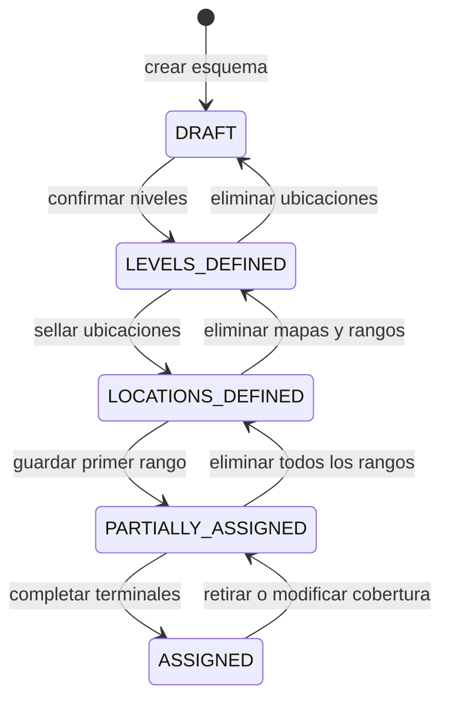

# Flujo de la aplicación V1

| Propiedad | Valor |
|---|---|
| Estado | Listo para implementación inicial; conserva pendientes no bloqueantes |
| Alcance | Configuración, publicación y consulta de un esquema de localización |
| Autoridad estructural | [`001_initial_schema.sql`](../../database/001_initial_schema.sql) y [`002_seed_basic_ordering_profile.sql`](../../database/002_seed_basic_ordering_profile.sql) |
| Autoridad bibliográfica | [`classification-ordering.md`](../classification-ordering.md), [`normalization.md`](../normalization.md) y [`comparable_key.md`](../comparable_key.md) |
| Autoridad funcional | Decisiones confirmadas por el responsable del proyecto |
| Revisar cuando | Cambien los estados del esquema, la publicación, la búsqueda o los contratos de mapas y rangos |

## 1. Propósito

Este documento reúne el flujo funcional completo de la V1: creación del esquema, definición de su jerarquía física, configuración de mapas, asignación de rangos, publicación y búsqueda.

La V1 distingue dos actores:

- **usuario registrado:** configura esquemas y ejecuta búsquedas internas de revisión; todos los usuarios registrados tienen los mismos permisos;
- **usuario público:** busca únicamente sobre el esquema activo y debe recibir al menos la representación superior del resultado.

No hay roles administrativos diferenciados en esta versión.

Las reglas se distinguen de esta forma:

- **Base de datos:** comportamiento comprobado por restricciones, funciones o triggers SQL.
- **Aplicación:** comportamiento que debe implementar la futura aplicación porque la base de datos no lo impone por sí sola.
- **Pendiente:** decisión funcional que todavía necesita definición.

## 2. Perfil de ordenamiento interno

El usuario no crea, configura ni selecciona un `ordering_profile` al crear un esquema. Este dato es infraestructura interna del sistema.

La migración `0.0.2`, implementada por [`002_seed_basic_ordering_profile.sql`](../../database/002_seed_basic_ordering_profile.sql), inserta el perfil único que utilizarán los esquemas de la V1:

| Campo | Valor |
|---|---|
| `name` | `ddc-base-v1` |
| `description` | `Contrato interno V1 para signaturas basadas en DDC.` |
| `ordering_spec_version` | `1.0.0` |
| `normalization_profile` | `base-1` |
| `comparable_key_version` | `1` (`ck1`) |
| `enabled` | `true` |

Este registro enlaza las versiones vigentes de los contratos de clasificación, normalización y clave comparable. No contiene las reglas: identifica el conjunto compatible de reglas utilizado para producir y comparar claves.

Al crear un esquema, la aplicación debe resolver internamente el perfil habilitado `ddc-base-v1` y guardar su `ordering_profile_id`. Si el perfil no existe, está deshabilitado o no coincide con las versiones anteriores, la creación debe fallar como error de configuración del sistema. No se debe ofrecer al usuario una alternativa manual.

Un perfil que ya tiene esquemas asociados no cambia de significado. Una modificación incompatible de cualquiera de los tres contratos requiere otro registro y una migración de las claves afectadas.

## 3. Ciclo de vida del esquema



| Estado | Niveles | Ubicaciones | Mapas | Rangos |
|---|---|---|---|---|
| `DRAFT` | Editables | No permitidas | No permitidos | No permitidos |
| `LEVELS_DEFINED` | Sellados | Editables | No permitidos | No permitidos |
| `LOCATIONS_DEFINED` | Sellados | Selladas | Configurables | Todavía no persistidos |
| `PARTIALLY_ASSIGNED` | Sellados | Selladas | Configurables | La aplicación exige al menos uno; cobertura incompleta |
| `ASSIGNED` | Sellados | Selladas | Configurables | Todos los terminales cubiertos |

Los mapas pueden configurarse desde `LOCATIONS_DEFINED` y no determinan por sí solos el estado del esquema.

## 4. Crear el esquema y definir niveles

### 4.1 Crear el esquema

1. El usuario aporta el nombre y, si corresponde, una descripción corta.
2. La aplicación obtiene el `ordering_profile_id` de `ddc-base-v1`.
3. La aplicación crea `schemes` en estado `DRAFT`, inactivo y habilitado.

### 4.2 Definir la gramática física

Durante `DRAFT`, el usuario construye el árbol de `scheme_levels`:

- existe un único nivel raíz;
- cada nivel descendiente referencia su nivel padre;
- los nombres y `sort_order` no se repiten entre hermanos;
- el árbol no contiene ciclos;
- cada rama desde la raíz hasta una hoja contiene exactamente un nivel con `is_search_terminal = true`.

Un terminal de búsqueda es el nivel donde se almacenará el rango bibliográfico. Puede ser una hoja física o un nivel anterior si la búsqueda no necesita más precisión.

### 4.3 Confirmar niveles

La interfaz presenta un resumen y solicita confirmación. La transición a `LEVELS_DEFINED` falla si el árbol no cumple las reglas anteriores. Una vez confirmada, la gramática queda sellada y se habilita la creación de ubicaciones.

## 5. Materializar y sellar ubicaciones

### 5.1 Generar el árbol físico

La aplicación instancia `locations` siguiendo la gramática:

1. crea una única ubicación raíz;
2. crea sus descendientes con el `scheme_level_id` correspondiente;
3. mantiene la relación entre la ubicación padre y el nivel padre;
4. asigna un `sort_order` único entre ubicaciones hermanas;
5. verifica que cada ubicación tenga al menos un hijo por cada nivel hijo definido en la gramática.

### 5.2 Nombres y códigos

La aplicación genera nombres y códigos estables:

- el nombre combina el nombre del nivel y un ordinal;
- el código serializa `scheme_id` y los `sort_order` de la ruta desde la ubicación raíz hasta la ubicación actual, separados por guiones;
- el código no está vacío y es único dentro del esquema;
- después de sellar la estructura, el código se considera inmutable porque los SVG lo utilizan como identificador.

La fórmula V1 es:

```text
code = join("-", [scheme_id, ...sort_orders_de_la_ruta])
```

Cada número usa su representación decimal sin ceros iniciales. Para el esquema `27` y la ruta `Piso 1`, `Fila 1`, `Cara 1`, `Mueble 4`, `Anaquel 5`, el código del anaquel es `27-1-1-1-4-5`. El mueble de esa ruta usa `27-1-1-1-4`.

Mientras el esquema está en `LEVELS_DEFINED`, cambiar un `sort_order` obliga a regenerar el código de esa ubicación y de todos sus descendientes. Después de pasar a `LOCATIONS_DEFINED`, ni los órdenes ni los códigos pueden cambiar.

Los separadores evitan colisiones entre rutas con órdenes de varios dígitos y permiten inspeccionar el código sin imponer un ancho fijo.

### 5.3 Sellar ubicaciones

Antes de pasar a `LOCATIONS_DEFINED`, la base de datos valida la raíz, las relaciones con los niveles, la cobertura de hijos y los códigos. La confirmación sella niveles y ubicaciones. Desde este estado se habilitan la configuración de mapas y la captura de rangos.

## 6. Configurar mapas

| Capa | Cardinalidad V1 | Uso |
|---|---|---|
| `TOP / STATIC` | Una o más; al menos una para publicar | Plano general con ubicaciones reales identificadas por código. |
| `FRONT / TEMPLATE` | Opcional | Vista reutilizable con variantes según cantidad de divisiones. |

La base de datos permite varias capas de ambos tipos. La aplicación aplica los requisitos de publicación y limita el drilldown de la V1 a una capa `TOP` que abre una capa `FRONT`.

### 6.1 Vista superior

1. La aplicación crea un `map_layer` con `view_type = TOP` y `render_mode = STATIC`.
2. El usuario selecciona los niveles físicos representados y la aplicación los registra en `map_layer_scheme_levels`.
3. La aplicación exporta un CSV con `location_code`, `name`, `level_name` y `sort_order`.
4. El diseñador crea el SVG y asigna `data-location-code` a cada elemento interactivo.
5. La aplicación recibe el archivo, lo almacena y registra su `asset_url`.
6. La aplicación sanitiza el SVG según la política de la sección 11.
7. La aplicación valida sobre el archivo sanitizado que cada código exista en el esquema y no se repita dentro del archivo.
8. Solo la versión sanitizada recibe un `asset_url` y se usa en la vista previa interactiva.

Ejemplo:

```xml
<rect data-location-code="27-1-1-1-4" x="10" y="20" width="40" height="20" />
```

Los códigos inexistentes o duplicados bloquean la carga.

Interpretación aplicada a la regla de publicación: cada ubicación terminal con rango debe tener un ancestro en el nivel representado por al menos una capa superior habilitada, y el código de ese ancestro debe estar presente en su SVG. De esta forma, todo resultado público puede señalarse en un mapa superior.

### 6.2 Vista frontal

1. La aplicación crea un `map_layer` con `view_type = FRONT` y `render_mode = TEMPLATE`.
2. La capa se asocia con exactamente un nivel representado, por ejemplo `Anaquel`.
3. Se crea una variante en `map_layer_svgs` por cada estructura necesaria, con `variant_code` y `slot_count`.
4. Cada SVG utiliza posiciones consecutivas mediante `data-slot`.
5. La aplicación asigna una variante a cada ubicación contextual mediante `map_layer_svg_assignments`.
6. La cantidad de hijos del nivel representado debe ser igual al `slot_count` de la variante asignada.

Ejemplo:

```xml
<rect data-slot="1" x="10" y="10" width="100" height="20" />
```

Una posición inexistente, duplicada o fuera de `1..slot_count` bloquea la carga. Una diferencia entre la cantidad de hijos y `slot_count` bloquea la asignación.

### 6.3 Drilldown

El registro de `map_layer_scheme_levels` correspondiente al nivel interactivo de la vista superior guarda el `drilldown_map_layer_id` de la vista frontal. La referencia permite pasar del elemento resaltado en el plano a la plantilla asignada a su ubicación contextual.

La V1 admite únicamente navegación de `TOP` a `FRONT`. Una capa frontal no inicia otro drilldown. Esta regla de aplicación evita cadenas y ciclos que la base de datos no prohíbe de forma general.

## 7. Asignar rangos bibliográficos

Los rangos solo pertenecen a ubicaciones cuyo nivel está marcado como terminal de búsqueda. Cada rango se guarda de forma atómica con:

- `range_start_raw` y `range_end_raw`;
- `range_start_normalized` y `range_end_normalized`;
- `range_start_key` y `range_end_key`.

La aplicación interpreta ambos extremos con `ddc-base-v1`, conserva el texto original y verifica que la clave inicial no sea mayor que la final.

Aunque la interfaz habilita la captura en `LOCATIONS_DEFINED`, la base de datos solo permite persistir claves en `PARTIALLY_ASSIGNED` o `ASSIGNED`. Por ello, el primer rango se guarda en una sola transacción:

1. cambiar el esquema de `LOCATIONS_DEFINED` a `PARTIALLY_ASSIGNED`;
2. escribir los seis campos del rango;
3. confirmar ambos cambios juntos.

Si la escritura falla, la transacción conserva el esquema en `LOCATIONS_DEFINED`. Los rangos siguientes se guardan en `PARTIALLY_ASSIGNED`. Cuando todos los terminales tienen un rango válido, la aplicación cambia el estado a `ASSIGNED`; el trigger vuelve a comprobar la cobertura completa.

Los rangos de ubicaciones distintas pueden solaparse. La consulta no elige un ganador: devuelve todas las ubicaciones cuyo rango contiene la clave buscada. La presentación de esos resultados se define en [Buscar y mostrar ubicaciones](#9-buscar-y-mostrar-ubicaciones).

## 8. Publicar y activar

Publicar y activar son operaciones relacionadas, pero distintas:

- publicar registra `published_by` y `published_at` juntos sobre un esquema en `ASSIGNED`;
- activar establece `is_active = true` y convierte el esquema habilitado en el origen de las búsquedas.

La interfaz puede ejecutarlas juntas, pero debe conservar esa diferencia. Al activar un esquema nuevo, la desactivación del anterior y la activación del nuevo deben ocurrir en una transacción.

La publicación exige:

1. esquema habilitado en estado `ASSIGNED`;
2. todos los terminales de búsqueda con rango;
3. al menos una capa habilitada `TOP / STATIC`;
4. cobertura superior para todos los terminales con rango, según la regla de la sección 6.1.

La base de datos garantiza los dos primeros puntos al activar y que exista como máximo un esquema activo. La aplicación comprueba los mapas y su cobertura antes de publicar.

La intención funcional es que un esquema publicado no se edite regresando estados. Para cambiar su estructura se crea un esquema nuevo en `DRAFT`, se configura y se activa cuando esté listo. La base de datos solo impide degradar el estado mientras el esquema siga activo; la política de clonación necesita control de aplicación.

## 9. Buscar y mostrar ubicaciones

### 9.1 Búsqueda pública

1. La aplicación obtiene el único esquema activo y su perfil interno.
2. Si no existe un esquema activo, detiene la búsqueda y muestra un mensaje comprensible para el usuario, sin detalles de base de datos ni configuración interna.
3. Interpreta y normaliza la signatura solicitada.
4. Genera la clave comparable `ck1`.
5. Obtiene todas las ubicaciones terminales cuyos rangos contienen la clave.
6. Resuelve los ancestros de cada resultado en el nivel representado por la capa superior.
7. Resalta todos los componentes superiores distintos encontrados.
8. Agrupa los resultados por ubicación contextual de la vista frontal.
9. Muestra una vista frontal por cada contexto distinto y resalta todos los slots coincidentes dentro de esa vista.

Si varios resultados pertenecen al mismo mueble, se muestra una sola vista frontal con varios slots resaltados. Si abarcan varios muebles, se resaltan todos en la vista superior y se muestran las vistas frontales disponibles de cada uno.

La vista frontal es opcional. Cuando no existe o no está asignada para un resultado, la búsqueda pública muestra solo la vista superior. La publicación garantiza que esa vista superior exista y cubra el resultado.

### 9.2 Revisión interna

Un usuario registrado puede ejecutar una búsqueda de revisión sobre un esquema específico, aunque todavía no esté activo. Si el mapa está incompleto, la revisión puede devolver únicamente la ruta textual y los rangos coincidentes. Este modo no está disponible para el usuario público.

## 10. Regresiones, correcciones y clonación

| Cambio | Precondición |
|---|---|
| `PARTIALLY_ASSIGNED` a `LOCATIONS_DEFINED` | Eliminar primero todos los rangos. |
| `LOCATIONS_DEFINED` a `LEVELS_DEFINED` | No deben existir rangos ni `map_layers`. |
| `LEVELS_DEFINED` a `DRAFT` | Eliminar primero las ubicaciones. |
| Esquema activo o publicado | Crear una nueva versión en `DRAFT`; no modificar la versión publicada. |

Las eliminaciones y el cambio de estado deben formar una operación transaccional. Si el esquema estuvo publicado, la aplicación conserva el original y trabaja sobre un clon inactivo y sin metadatos de publicación.

Al clonar, el usuario elige uno de estos alcances:

| Alcance | Datos copiados | Estado inicial del clon |
|---|---|---|
| Solo niveles | Datos del esquema y `scheme_levels` | `DRAFT` |
| Niveles y ubicaciones | Lo anterior más `locations`, sin rangos | `LEVELS_DEFINED` |
| Todo | Niveles, ubicaciones, rangos, capas, SVG y asignaciones | Estado correspondiente a la cobertura copiada; nunca activo ni publicado |

Todo clon recibe un nuevo `scheme_id`. Si se copian ubicaciones, la aplicación regenera sus códigos con el identificador nuevo. La copia completa también debe actualizar los `data-location-code` de los SVG superiores; el tratamiento de los archivos locales forma parte del pendiente `WF-OPEN-09`.

## 11. Fallos de carga y consistencia

| Condición | Resultado V1 |
|---|---|
| SVG con contenido activo, eventos o referencias externas | Eliminar el contenido peligroso y continuar con el archivo sanitizado. |
| `data-location-code` inexistente o duplicado | Rechazar el archivo. |
| `data-slot` inválido o duplicado | Rechazar el archivo. |
| Cantidad de hijos distinta de `slot_count` | Rechazar la asignación. |
| Ubicación terminal con rango sin representación superior | Permitir revisión interna, pero bloquear publicación. |
| Fallo al guardar un rango | Revertir rango y transición de estado. |

La sanitización elimina, como mínimo:

- elementos `script`, `foreignObject`, `iframe`, `object` y `embed`;
- atributos cuyo nombre comienza con `on`, sin distinguir mayúsculas;
- entidades externas, declaraciones DTD y referencias de red;
- valores externos en `href` y `xlink:href`; solo se permiten referencias internas con formato `#identificador`;
- `@import` y referencias externas mediante `url(...)` en estilos.

El XML mal formado se rechaza. Después de eliminar contenido peligroso, el sistema vuelve a validar códigos, slots y estructura. Si el resultado ya no cumple el contrato del mapa, también se rechaza. La entrada original nunca se publica como recurso.

El almacenamiento de archivos debe coordinarse con la transacción de base de datos. La eliminación de un archivo huérfano tras un fallo y el versionado de recursos todavía no están definidos.

## 12. Responsabilidades de la aplicación

Además de presentar la interfaz, la aplicación debe:

- aplicar el mismo permiso administrativo a todos los usuarios registrados;
- seleccionar el perfil `ddc-base-v1` sin intervención del usuario;
- generar nombres, códigos y archivos CSV;
- interpretar signaturas y producir claves compatibles;
- ejecutar en una transacción los cambios que combinan estado y datos;
- sanitizar los SVG y persistir solamente el resultado seguro;
- validar la cobertura superior requerida para publicar;
- restringir el drilldown a `TOP` con destino `FRONT`;
- devolver y representar todos los rangos coincidentes;
- impedir cambios estructurales sobre esquemas publicados;
- informar errores de configuración sin exponer detalles internos innecesarios.

## 13. Pendientes no bloqueantes de la V1

| ID | Pendiente | Estado actual |
|---|---|---|
| `WF-OPEN-09` | Ciclo de vida de archivos SVG. | Los archivos quedan locales. No están definidos rutas, reemplazo, historial, limpieza de huérfanos ni reescritura al clonar. |
| `WF-OPEN-11` | Edición administrativa concurrente. | La V1 asume que no habrá administradores editando al mismo tiempo. El control de concurrencia queda pendiente. |
| `WF-OPEN-12` | Selección entre futuros perfiles internos. | Pendiente hasta que exista más de un perfil; la decisión seguirá siendo interna al sistema. |

## 14. Verificación mínima de la V1

El flujo se considera implementado cuando se puede demostrar que:

- la migración `0.0.2` deja disponible exactamente el contrato `ddc-base-v1` esperado;
- crear un esquema asigna ese perfil sin solicitarlo al usuario;
- los códigos se generan desde `scheme_id` y la ruta de `sort_order`;
- las transiciones rechazan árboles o coberturas incompletos;
- el primer rango cambia el estado y guarda sus datos atómicamente;
- la importación de SVG rechaza identificadores inválidos e impide habilitar contenido activo;
- la publicación exige cobertura superior para todos los terminales con rango;
- una búsqueda pública falla de forma comprensible cuando no existe esquema activo;
- una búsqueda solapada resalta todas las ubicaciones superiores y agrupa las vistas frontales por contexto;
- una búsqueda sin vista frontal sigue mostrando la capa superior;
- la revisión interna puede presentar un resultado textual sobre un esquema no activo;
- el drilldown se limita a `TOP` con destino `FRONT`;
- la clonación ofrece los alcances definidos y nunca crea un clon activo o publicado.
